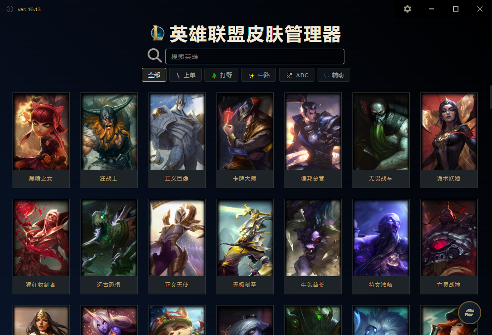
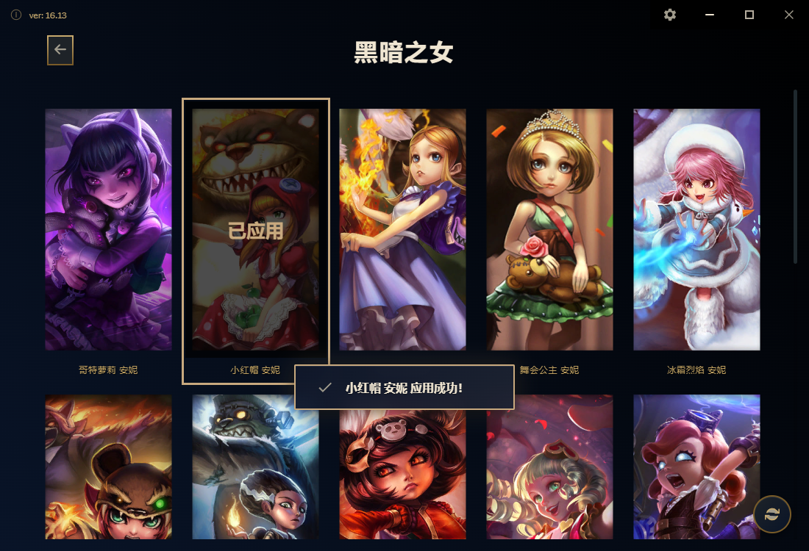
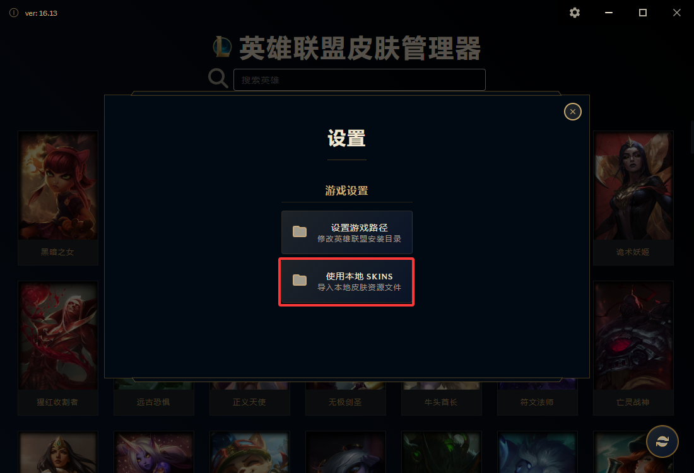

# League Skins

一款基于`cslol-manager`的英雄联盟 Windows 换肤工具。

<p align="center"><b><font size="5" color="#e74c3c">⚠️ 使用前需自行导入皮肤包，本工具不提供皮肤文件！</font></b></p>

<div align="center">
  
  
  
</div>


## 开发

```bash
git clone https://github.com/Hopelsz/league-skins-tool.git
cd league-skins
## 安装依赖
npm install
## 开发模式
npm run dev
## 自行打包
npm run build:win
```

## 免责声明

本项目未获得 Riot Games 的认可，也不代表 Riot Games 或其任何关联公司的观点或意见。英雄联盟及所有相关资产均为 Riot Games, Inc. 的商标或注册商标。

此外，我无法确定本软件是否违反 Riot Games 的服务条款。使用本软件可能违反其政策，我无法保证其是否会被检测到或导致封号。使用本软件的风险由您自行承担，我对任何后果概不负责，包括但不限于 Riot Games 施加的账号处罚、封禁或限制。
